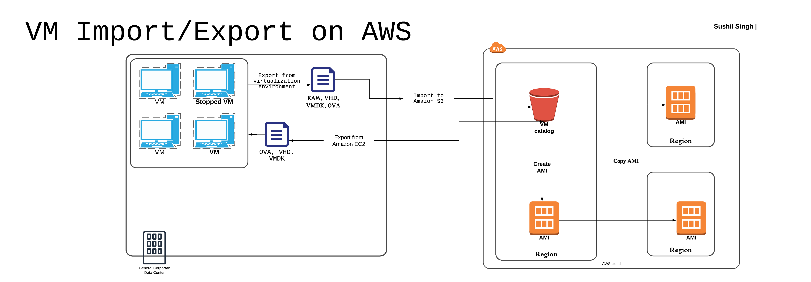

# What is VM Import/Export ?

+ VM Import/Export enables you to **import virtual machine (VM) images** from your existing virtualization environment to Amazon EC2, and also to **export** them back.

+ Enables you to **migrate applications and workloads** to Amazon EC2

+ Copy your VM image catalog to Amazon EC2, or **create a repository of VM images for backup and disaster recovery**.

# Infrastructure Diagram

## Prerequisite: 

+ [Download , install and configure AWS Command Line Interface](http://docs.aws.amazon.com/cli/latest/userguide/installing.html) + Verify that your VM satisfies the [prerequisites for VM import](http://docs.aws.amazon.com/AWSEC2/latest/UserGuide/VMImportPrerequisites.html), prepare it for import, and export it from its current environment as an OVA file ( or VMDK, VHD, or RAW)
+ Create an IAM role names **vmimport**. For more information, see [Required Service Role](https://docs.aws.amazon.com/vm-import/latest/userguide/vmie_prereqs.html#vmimport-role)

## VM Import/Export Steps:

1. Export VM from its current environment as an OVA file (or VMDK, VHD, or RAW) if your are testing this make sure the VM has atleast one user configured with password)

2. Create a S3 bucket and upload the VM image to S3 using upload/drag and drop or using AWS CLI

3. Once the VM image is uploaded, import your VM using the **ec2 import-image** command. As part of this command, you can specify the licensing model and other prarameters for your imported image.

4. Use the **ec2-describe-import-image-tasks** command to monitor the import progress

5. Once your import is completed, you can use the **ec2 run-instances** command to create an Amazon EC2 instance from the AMI generated during the import process or launch EC2 Instance from the AMI created using console, or Copy the AMI to other region.

# Resources
[VM Import/Export](https://aws.amazon.com/ec2/vm-import/)

